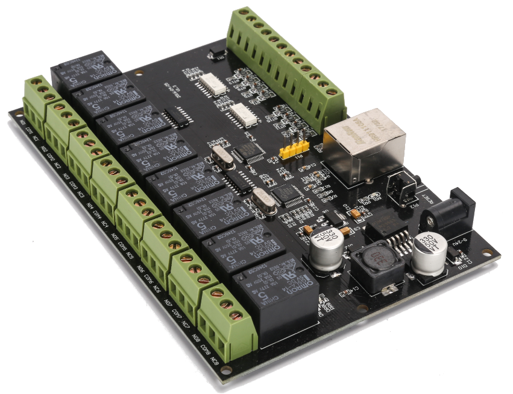

# Configuration tools and examples for unbranded board, 8-Port Relay with Ethernet connectivity

This project provides configuration tools for this generic relay board manufactured without supplier labels:



The product is normally advertised as "8-way Network Relay Module IP/Ethernet Access Controller Switch Volume Transfer MODBUS TCP"

Sometimes it can be found with an identification: **HHC-N-8I8O**

## Defaults
The product by default is configure to:

- listen for relay commands via TPC requests, with the following details:

```
 gateway: 192.168.0.1
 mask: 255.255.255.0
 local_ip_address: 192.168.0.105
 local_port: 5000-5003,
``` 

- listen to configuration packets via UDP requests to:

```
 gateway: 192.168.0.1
 mask: 255.255.255.0
 local_ip_address: 192.168.0.105
 local_port: 65535,
``` 
and responds the sender of configuration commands with UDP packets on port 65534

## Relay commands

To switch the relays, two commands are available
- `on#:DD` **switch-on**: where `# `is a single digit number from 1-8 and "DD" is a left zero-padded number from "00" to "99"
  - `#` is a relay index (1 to 8 as there are 8 relays)
  - `DD` is a delay to **switch-off** the relay in the amount of `DD` seconds provided.
  - `DD` is optional, and when not provided switches-on the relay. (example without `DD` : `on3`)
- `off#` **switch-off**: where `# `is a relay index (1 to 8 as there are 8 relays)
- `read` **current relay's state**: requests the state of all relays. The response to this command has the format `relay########`, where the `########` is a binary bit mask representing the status of each relay (example `relay00000100`)
- `all########` **set all relays**: sets the state of all relays, `########` is 8 digits containing 0's and 1's, it also executes a `read` command
- `input` **current input's state** requests the state of all inputs connected to the board. The response to this command has the format `input########`, where the `#` is a binary bit mask representing the status of each relay (example `input00000100`)

examples
 - sent `on2:12` -> relay number 2 switch-on and after 12 seconds switch-off
 - sent `on4` -> relay number 4 changes to `switch-on` state
 - sent `off8` -> relay number 8 changes to `switch-off` state
 - sent `read` -> receives `relay00000100` -> means relay 3 is in `switch-on` state, and the remainder are in `switch-off` state
 - send `all00000101` -> relays 1 and 3 are set **switch-on** and the remainder **switch-off**)
 - send `input` ->  receives `input00000100` -> means input 3 is set and the remainder are not set
## Provided files

These are the ruby scripts provided to perform routines on the equipment. Ruby version used to create the scripts: `ruby 2.7.2p137`

- `find_units.rb`: issues 256 broadcast UDP packets.

  These trigger the units who receive them to reply with their configurations.
  The response is then decoded and displayed
- `program_unit.rb`: issues the configuration packet to the unit.

  The response expected is the string "OK" for success and no response for failures.
- `turn_relay_on_off.rb`: issues the commands to turn on and off all relays as well as verifies if the relays have achieved the expected state.

## Issues / Improvements

Please raise a github issue if you which to report issues or discuss enhancements.
